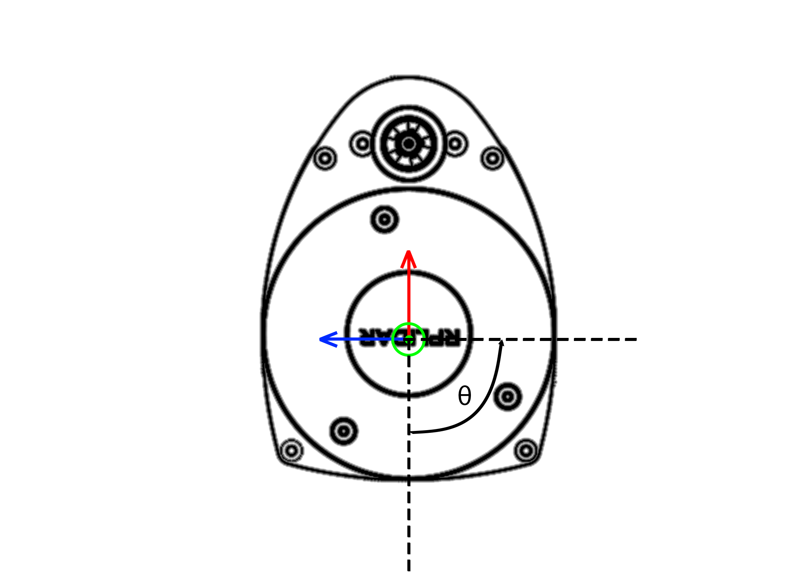
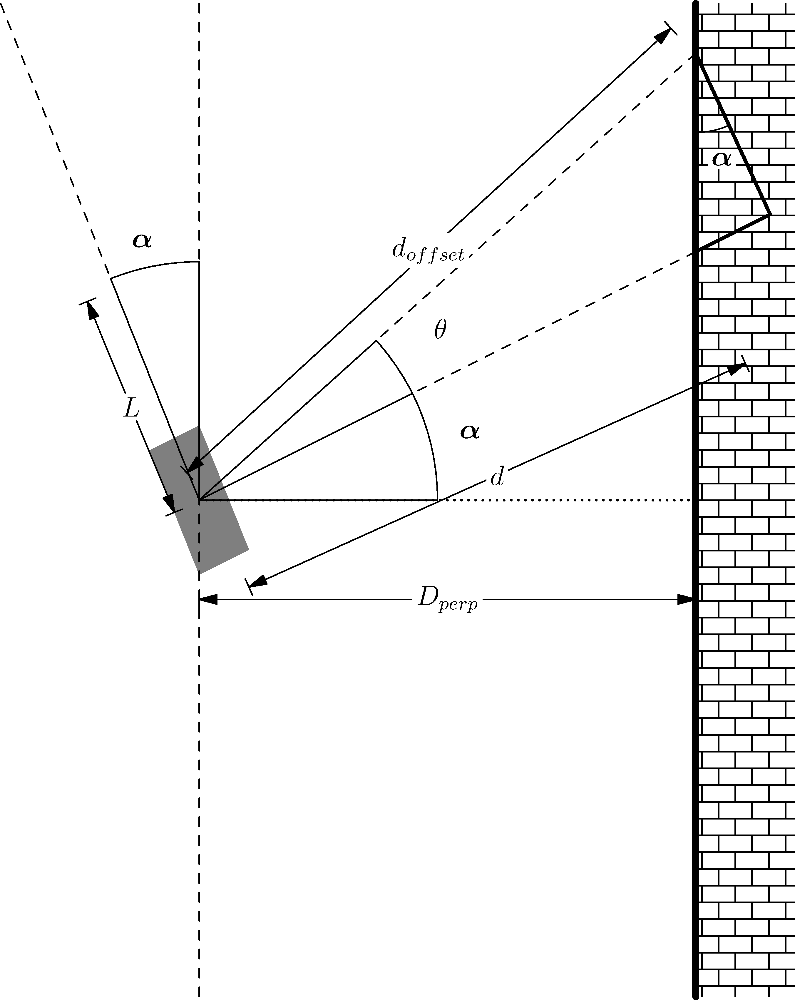

Homework 5: LiDAR PID Wall Following
====================================

Deliverables
^^^^^^^^^^^^
This assignment introduces a wall following algorithm to stay a set distance away from the wall. The controller used here is a PID controller, think 
cruise control on your car. Additionally, you will need the node, check to see if the start or stop button was pressed from a joystick.

Expected Behavior:
~~~~~~~~~~~~~~~~~~
* Subscriber 1: The node will monitor Joy to check if the joystick's 'start' and 'stop' button was pressed.
* Subscriber 2: Everytime a scan topic arrives:
    * Calculate current distance from wall
    * Calculate error at time ``t``
    * Calculate change in sterring angle
    * publish ``ackermann_msgs`` with new sterring angle

You should have two subscriber topics: ``scan`` for the Lidar and ``joy`` for the joystick and one publisher topic ``vechile_command_ackermann``.

General Overview
~~~~~~~~~~~~~~~~
* **Due Date:** March 28th, 2025
* **Points:** 20
* ROS 2 Topics: ``scan`` and ``joy`` (sub) and ``vehicle_command_ackermann`` (pub)
* ROS 2 Messages: ``LaserScan`` and ``Joy`` in ``sensor_msgs`` (sub) and ``AckermannDriveStamped`` in ``ackermann_msgs`` (pub) 

LiDAR and You
^^^^^^^^^^^^^

LiDAR Data
~~~~~~~~~~

First you must understand how the LiDAR data is being published. The LiDAR data is published in the ROS2 topic ``scan`` with the message `LaserScan <http://docs.ros.org/en/noetic/api/sensor_msgs/html/msg/LaserScan.html>`_. You realistically only need the ``ranges`` part of the message and maybe the header for consistencies sake.

The ranges are stored in the form of distances in meters. To parse through the range data, it is important to understand Figure 1.

    Figure 1: Ranges defined from 0 degrees. Red is :math:`+x` and Blue is :math:`+y`.

Here on our Lidar, distances are given from the :math:`-x` or :math:`180^{\circ}` from the red arrow and move in a counter clock-wise direction. Therefore the first distance will point straight back on your car.
There are 720 data points, therefore the angular resolution of the LiDAR is half a degree. Therefore to parse through the data if you want to get :math:`90^{\circ}` degrees or :math:`180^{\circ}` from the blue line you need to 
look for the data point :math:`[180]`.

.. warning:: Remember that the data is 180 degrees out of phase, so you will have to account for that.

Running The LiDAR
~~~~~~~~~~~~~~~~~

To launch the lidar on the car you can run the following command:

.. code-block:: bash

    ros2 launch vehicle_launch vehicle_lidar.launch.py

Visualizing the ``LaserScan``
~~~~~~~~~~~~~~~~~~~~~~~~~~~~~

TODO

To visualize both the LaserScan and the PointCloud, you should be able to launch a file from your workspace that does this. You can download the launch package :download:`here <homework_files/lidar_launch.zip>`. The following command will launch Rviz2

.. code-block:: bash

    ros2 launch lidar_launch lidar_rviz_launch.py

That's pretty much all you need to be successful in completing this milestone. If you have any problems `contact the TA's or Instructor <../../assistance/contact.html>`_.

Finding The Perpendicular Distance
^^^^^^^^^^^^^^^^^^^^^^^^^^^^^^^^^^

Dr. Crane's method
~~~~~~~~~~~~~~~~~~
TODO

First, you need to get :math:`d_{1}` which is the LiDAR value along :math:`-y` axis.

Second, you need to get :math:`d_{2}` which is the LiDAR value at angle :math:`\theta`, the offset angle you chose from the :math:`-y` axis.

Now, you can calculate :math:`d_{3}` with the following equation:

.. math::

    d_3 = d_1^2 + d_2^2 - 2 d_1 d_2 \cos \theta

Now we have to the unit direction vector that is pointing from :math:`P_{1}` to :math:`P_{2}`:

.. math::

    v = \frac{(x_2 - x_1) \hat{i} + (y_2 + y_1) \hat{j}}{d_3}

.. note:: :math:`(x_{1}, y_{1})` and :math:`(x_{2}, y_{2})` are the x and y values from :math:`d_{1}` and :math:`d_{2}`, respectively.

Afterwards, we can :math:`\alpha` using the following equations:

.. math::

    \cos \alpha = \frac{x_2 - x_1}{d3}

    \sin \alpha = (v' x_{sensor}) \times \hat{h}

With alpha, you can find the distance from the wall using the following equation:

.. math::

    d_{wall} = d_1 * \cos \alpha

You can find the error, which is the desired set distance from the wall minus the distance you calculated.

.. math:: 

    e = d_{setpoint} - d_{wall}

Aditya and Patrick's Method
~~~~~~~~~~~~~~~~~~~~~~~~~~~

To find the perpendicular distance, first the angle alpha as shown in the figure below has to be found.

    

    Figure 2: Geometry for Perpendicular Distance

:math:`\alpha` can be found using the following:

.. math:: 

    \alpha = \arctan \left( \frac{d_{offset} \cos \theta - d}{d_{offset} \sin \theta} \right)

where :math:`\theta` is the offset angle you chose from the right side of the car, with :math:`d_{offset}` being the offset distance and :math:`d` as the perpendicular distance from the vehicle coordinate system.

Next you can simply find the perpendicular distance :math:`D_{perp}` by using the following

.. math::

    D_{perp} = d \cos \alpha

Now, you cannot simply use the perpendicular distance as with this the car will not be able to react quickly enough causing overshoots. To counteract this, 
a look ahead distance :math:`L` is established. You can use this :math:`L` to find a perpendicular distance to add as such

.. math::

    D_{perp+L} = L \sin \alpha + D_{perp}

.. hint:: You :math:`L` should be between 10 and to 30 cm in front of the car and :math:`\theta` should be between 15 and 30 degrees from the cars perpendicular.

.. warning:: Set your values for speed to be relatively slow, around 1m/s. Any faster it could possibly crash into the wall.

Now with the look ahead distance, you can find the error, which is the desired set distance from the wall minus the distance you calculated.

.. math:: 

    e = d_{setpoint} - D_{perp+L}

Optional Test: Bang-Bang Controller
^^^^^^^^^^^^^^^^^^^^^^^^^^^^^^^^^^^

Originally, we would do a Bang-Bang Controller before moving onto PID. **So this part is optional, and can be skipped.**

**However,** you are still welcome to use this controller to test if your perpendicular distance program works as intended.

A Bang-Bang controller is a 2 state controller that abruptly changes from a state to another, in our case from steering left to right. To determine which state
you are in, providing feedback to your controller, you will find the perpendicular distance from the wall to your car (covered in the next section). If it is too far away from the wall,
steer in the opposite direction that you are currently and vice versa. 

For our problem here, we will be following the right wall. If it is too far from the right wall you want to max turn right, and if it is too close, max turn left.
You can model this by using two states of -1 and 1. If an error you take from a set distance and the true distance, depending on how you structure the math, each sign will 
correspond to a turning right or left. The error can be calculated as such

.. math:: 

    e = d_{setpoint} - D_{perp}

Which then can give you the equation for a Bang-Bang as 

.. math::

    \phi =    \begin{matrix}
              -\beta & \text{if } e > 0\\
              \beta & \text{if } e < 0\\
              \end{matrix}

where :math:`\phi` is the steering angle, and :math:`\beta` is a set steering angle that your controller will oscillate between. 

.. warning:: Remember that the car has actuation limits on the steering to be between -45 and 45.

.. note:: You can change the order as needed to get a certain positive or negative value.

.. hint:: Try to get the right turn to be positive and the left turn as negative. Using the ``numpy.sign()`` function should make this trivial. Just ensure you filter out ``NaN`` values with ``np.isnan()``.

PID Controller
^^^^^^^^^^^^^^^^^^^^

More info on PID Controllers can be found `here <../../information/theoryinfo/pid.html>`_. PID controllers are simple controllers that employ feedback and continuously controls
as system based on an error. The idea is to drive that error to 0 based on the Proportional (P), Integral (I) and Derivate (D) controller terms. The error
can be calculated as follows,

.. math::

    e(t) = r - y,

where :math:`e(t)` is the error w.r.t time, :math:`r` is the desired set point (value you want your system to be at) and :math:`y` is the system output (:math:`\dot{x}`).

The simplest form of a PID is multiplying your controller by a fixed or proportional gain. A form that is often given in theoretical controls classes (EML4312)

.. math::

    u = K_p e(t),

where :math:`u` is the control command given to the system and :math:`K_p` is the proportional gain.

The next term, the Integral (I) controller has the following equation,

.. math::

    u = \int_{0}^{t} K_i \, e(t) \, dt,

where :math:`K_i` is the integral gain. The integral controller in this form is not very useful to us. An alternative form is,

.. math::

    u = K_i \sum_{k=1}^{k} e_k \Delta t.

The idea is you take your old values of :math:`e_k` (the error) and you keep adding to it's self and multiplying by a fixed integral gain :math:`K_i`.
:math:`\Delta t` is just taking your current :math:`t_k` and subtracting the old one (previous iteration) :math:`t_{k-1}`, where :math:`k^th` is the current iteration.

.. note:: :math:`\Delta t` Can and probably should be set to a constant value of 10Hz or 0.1s.

You will need to window your integral controller, i.e. only sum up the last certain amount of error values. Usually for our case it could be around 100 to 200 values.

.. hint:: Storing the errors as a list and then summing them up will be the easiest method to achieve this. You can also use the ``pop()`` function in python to remove a certain value from a list.

The final term is the derivative (D) controller which multiplies a gain by the derivative or slope of your error over time. The equation of this controller would be

.. math::

    u = \dfrac{d}{dt} e(t) K_d.

where :math:`K_d` is the derivative gain. A more useful form of this controller is,

.. math::

    u = K_d \dfrac {e_k - e_{k-1} } {t_k - (t_{k-1})}

A full Proportional, Integral and Derivate (PID) controller is essentially just mashing all three controllers together and has the following equation,

.. math::
    
    u = K_p e(t) + \int_{0}^{t} K_i \, e(t) \, dt + \dfrac{d}{dt} e(t) K_d

or

.. math:: 

    u = K_p e_k + K_i \sum_{k=1}^{k} e_k \Delta t + K_d \dfrac {e_k - e_{k-1} } {t_k - (t_{k-1})}.

You do not need to use the full PID controller you can use PI or PD controllers as well or other formats. See which one works best and use that for your controller.

You will need to assign a :code:`self.var` to store your old values of integral addition errors time and error. You will then use the :math:`u` message as the ``vehicle_command_angle`` value.

.. warning:: Remember that the car has actuation limits on the steering to be between -45 and 45.

.. note:: You can change the order as needed to get a certain positive or negative value.

.. hint:: Try to get the right turn to be positive and the left turn as negative. Using the ``numpy.sign()`` function should make this trivial. Just ensure you filter out ``NaN`` values with ``np.isnan()``.
