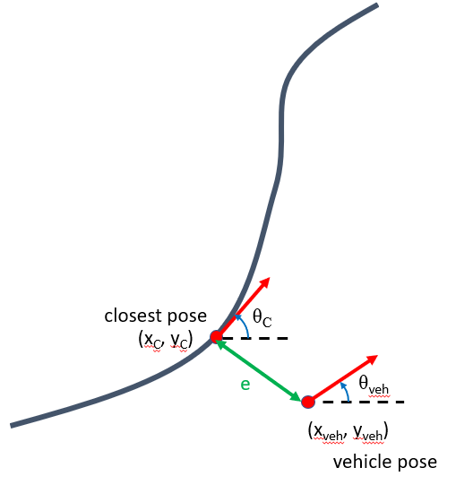

Homework 9: Path Navigation Simulation using Stanley Controller
===============================================================

General Overview
^^^^^^^^^^^^^^^^

* **DUE DATE:** TBD
* **POINTS:** 30
* ROS 2 Topics: TODO
* `ROS 2 Messages <../../information/ros2_common_msgs.html>`_ : TODO

Deliverables
^^^^^^^^^^^^

* A video of rviz showing the run using the Stanley controller
* A plot of cross track distance vs. 'time' for all four controllers (similar to slide 20 in the class PowerPoint file) (OPTIONAL)

Task
^^^^

The gps_nav package provides an implementation of the circular arc.

Modify the vehicle controller node in the gps_nav package to implement the following controllers:

* point at carrot
* 3rd order curve controller
* Stanley

Stanley Controller 
^^^^^^^^^^^^^^^^^^^

The stanley controller is controller developed by the Stanford Racing Team during the 2005 DARPA Grand Challenge. Stanley, the teams 
vehicle, went on to win the competition. 

The outputs and inputs for this controller are given below.

Inputs:
    * Vehicle Pose: :math:`x_{veh}`. :math:`y_{veh}`, :math:`\theta_{veh}`
    * Closest Pose on Path: :math:`x_{c}`, :math:`y_{c}`, :math:`\theta_{c}`

Outputs:
    * Steering Angle: :math:`\phi`

The objective is to determine the steering angle to drive the vehicle to the path based on the current vehicle position and orientation. It will be minimizing the difference in heading and the 
the cross track error :math:`e_{cte}`.

    
    Figure 1: Definition of Stanley Controller Problem

The governing equation of this controller is as follows,

.. math:: 

    \phi = (\theta_c - \theta_{veh}) + \arctan \frac{k e_{cte}}{1+v}

where :math:`e_{cte}` is the distance between the closest and the vehicle projected along the closest pose's y coordinates and :math:`v` is the speed.

.. note:: :math:`e_{cte}` will be negative if the closest point on the path is to the right of the vehicle pose.

Controller File Template
^^^^^^^^^^^^^^^^^^^^^^^^
 To calculate the crosstrack error call the function 

.. code-block:: python

    crosstrack_error,error_heading_rad, _ = get_cross_track_and_heading_error(closest_pt,heading_closest_rad,vehicle_pt, heading_vehicle_rad)
    

This should return a tuple with the two errors you need for the stanley. 

The template file can be downloaded below,

:download:`Controller Template <../projects/project_files/vehicle_controller_template.py>`

Put your controller in the ``main_timer_callback`` onwards.

Simulate your project by using a launch file similar to this,

:download:`Launch File for Point at Carrot <../projects/project_files/simulation_demo.launch.py>`

.. note:: Your launch file should be in a launch folder inside your package, something like ``package_name/launch/example_launch.py`` . Otherwise when you build the package it will fail.

Use the setup.py file given below to allow for launch files to work.

:download:`Setup File <../projects/project_files/setup.py>`