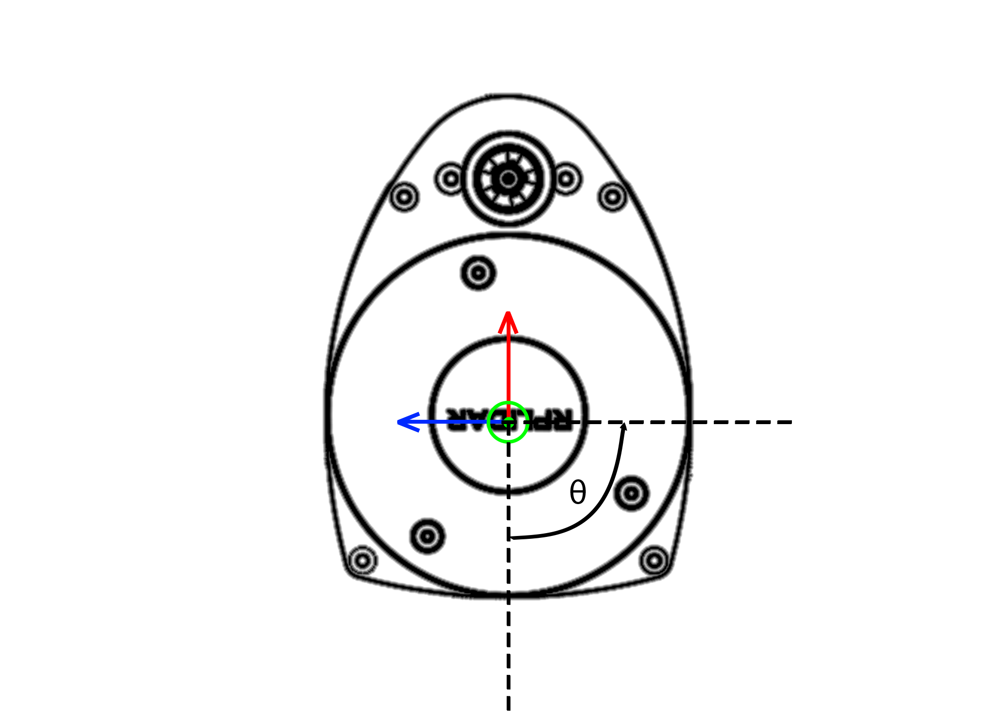

Milestone 2: Creating a ROS 2 Node for Converting Data
======================================================

By now you should have gone through the basics of creating a node in ROS 2 in class and milestone 1. As the most prominent form of ROS 2 node used in this class will be a publisher and subscriber, 
an assignment covering that with a full complex message structure would be useful.

This assignment or milestone will be to complete a full ROS 2 node on your own that converts LiDAR radial distance measurements into the cartesian form. This milestone has the following pertinent information

* **Due Date:** September 30th, 2022 (after Python learning has been completed)
* **Points:** 20
* ROS 2 Topics: scan (sub) and cart_coord (pub)
* ROS 2 Messages: ``LaserScan`` (in ``sensor_msgs``), ``PointCloud`` and ``Point32`` (both in ``geometry_msgs``)
* A launch file to launch the lidar topic has been give in the ``av1tenth`` repo but there should also be a ros2 bag file in the ``bag_files`` folder that you can run with the following command
  
.. code-block:: bash

    ros2 bag play filename

Deliverables
^^^^^^^^^^^^
ROS 2 node that converts the LaserScan message to PointCloud and publish a ``cart_coord`` topic. If you want to test this live you can come in to the lab MAE-B 131 to test it out on one of the vehicles. Grading will be based on performance of the node,
if it publishes data correctly you will get full points. A full list of deliverables are given below

* ROS 2 Publisher Node publishing topic ``cart_coord``
* A launch file that will play the ROS 2 bag file and run your node
* ``setup.py`` file filled out
* ``package.xml`` file filled out properly
* .zip file containing entire package (We should be able to download the file and put it into ROS 2 and run it without changing anything)
  
.. warning:: The names of topics are important, writing the wrong name will result in a **25% point** deduction.

LiDAR Data
^^^^^^^^^^

First you must understand how the LiDAR data is being published. The LiDAR data is published in the ROS2 topic ``scan`` with the message `LaserScan <http://docs.ros.org/en/noetic/api/sensor_msgs/html/msg/LaserScan.html>`_. You realistically only need the ``ranges`` part of the message and maybe the header for consistencies sake.

The ranges are stored in the form of distances in meters. To parse through the range data, it is important to understand Figure 1.

    Figure 1: Ranges defined from 0 degrees. Red is :math:`+x` and Blue is :math:`+y`.

Here on our Lidar, distances are given from the :math:`-x` or :math:`180^{\circ}` from the red arrow and move in a counter clock-wise direction. Therefore the first distance will point straight back on your car.
There are 720 data points, therefore the angular resolution of the LiDAR is half a degree. Therefore to parse through the data if you want to get :math:`90^{\circ}` degrees or :math:`180^{\circ}` from the blue line you need to 
look for the data point :math:`[180]`. 

Converting Math
^^^^^^^^^^^^^^^
To convert a distance based on radians you can convert using simple trigonometry. The following equations will help you convert this data

.. math:: 
    x = d \cos{\theta}, \tag{1}

and

.. math::
    y = d \sin{\theta}, \tag{2}

where :math:`d` is the distance from ranges, :math:`\theta` is the angle that you are currently at, but remember it is :math:`180^{\circ}` out of phase. That's pretty much it,
that is all you need to complete the conversion. Your :math:`z` point will be 0.

PointCloud Message
^^^^^^^^^^^^^^^^^^

Next you need to be able to get all this data into your ``PointCloud`` message. To do this it would be useful to iterate over the range data and append it. The `PointCloud <http://docs.ros.org/en/noetic/api/sensor_msgs/html/msg/PointCloud.html>`_ message requires 
and array of ``Point32`` points as its points array. It would also be useful to take the header data from the ``LaserScan`` message and plug into to the ``PointCloud`` Message.
You should know how to iterate over an array by now so that will not be covered, but to append to an array you can use the following

.. code-block:: python

    append(var)

That's pretty much all you need to be successful in completing this milestone. If you have any problems `contact the TA's or Instructor <../../assistance/contact.html>`_.

