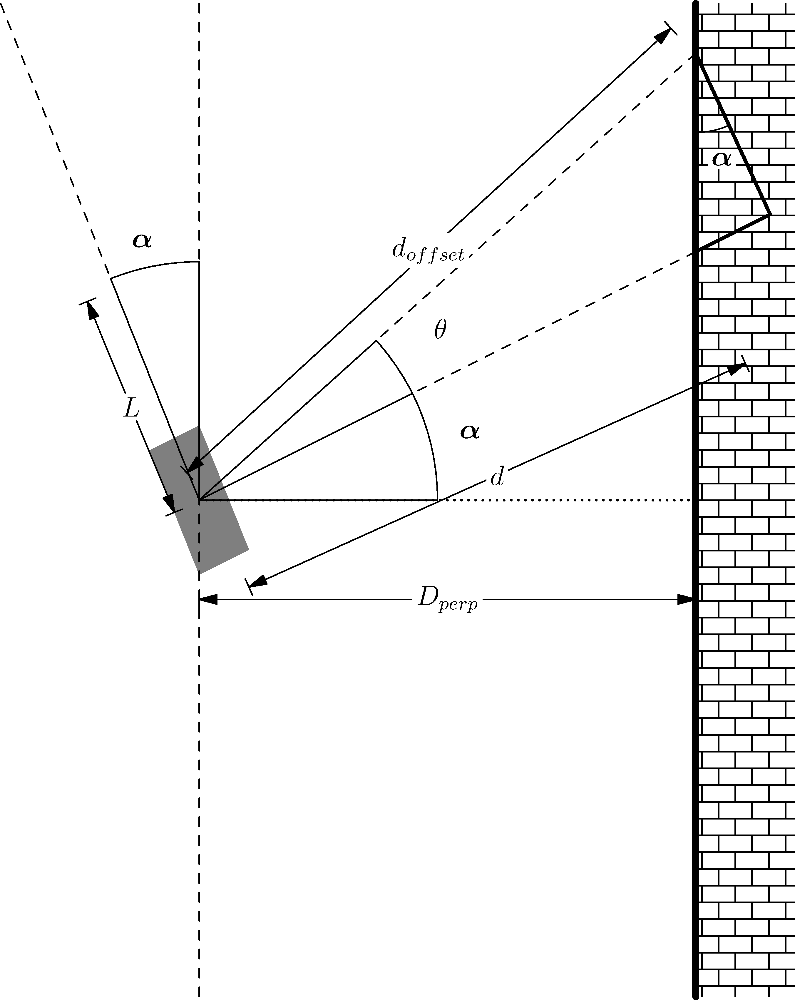

Milestone 3: Wall Following Controller (Bang-Bang)
====================================================

This assignment introduces a wall following algorithm to stay a set distance away from the wall. The controller used here is a bang-bang controller, which is a feedback based controller
that discretely cycles from state to another (think thermostat or your oven).

* **Due Date:** March 3rd, 2023
* * **Pseudo Code Due Date:** February 27th, 2023
* **Points:** 20
* ROS 2 Topics: ``scan`` (sub) and ``vehicle_command_ackermann`` (pub)
* ROS 2 Messages: ``LaserScan`` in ``sensor_msgs`` (sub) and ``AckermannDriveStamped`` in ``ackermann_msgs`` (pub) 

Deliverables
^^^^^^^^^^^^
ROS 2 node with a Bang-Bang controller for your vehicle steering.

* Pseudo Code for your Node. More information can be found `here <../../information/code/pseudocode.html>`_
* ROS 2 Publisher Node publishing topic ``vehicle_command_ackermann``
* ``setup.py`` file filled out
* ``package.xml`` file filled out properly
* .zip file containing entire package (We should be able to download the file and put it on a vehicle and run it without changing anything)

Bang-Bang Controller
^^^^^^^^^^^^^^^^^^^^

A Bang-Bang controller is a 2 state controller that abruptly changes from a state to another, in our case from steering left to right. To determine which state
you are in, providing feedback to your controller, you will find the perpendicular distance from the wall to your car (covered in the next section). If it is too far away from the wall,
steer in the opposite direction that you are currently and vice versa. 

For our problem here, we will be following the right wall. If it is too far from the right wall you want to max turn right, and if it is too close, max turn left.
You can model this by using two states of -1 and 1. If an error you take from a set distance and the true distance, depending on how you structure the math, each sign will 
correspond to a turning right or left. The error can be calculated as such

.. math:: 

    e = d_{setpoint} - D_{perp}

Which then can give you the equation for a Bang-Bang as 

.. math::
    
    \phi = 
        \begin{cases}
            -\beta & \text{if} e > 0\\
            \beta & \text{if} e < 0\\

        \end{cases}

where :math:`\phi` is the steering angle, and :math:`\beta` is a set steering angle that your controller will oscillate between. 

.. warning:: Remember that the car has actuation limits on the steering to be between -45 and 45.

.. note:: You can change the order as needed to get a certain positive or negative value.

.. hint:: Try to get the right turn to be positive and the left turn as negative. Using the ``numpy.sign`` function should make this trivial. Just ensure you filter out ``NaN`` values.

Finding The Perpendicular Distance
^^^^^^^^^^^^^^^^^^^^^^^^^^^^^^^^^^

To find the perpendicular distance, first the angle alpha as shown in the figure below has to be found.

    

    Figure 1: Geometry for Perpendicular Distance

:math:`\alpha` can be found using the following:

.. math:: 

    \alpha = \arctan \left( \frac{d_{offset} \cos \theta - d}{d_{offset} \sin \theta} \right)

where :math:`\theta` is the offset angle you chose from the right side of the car, with :math:`d_{offset}` being the offset distance and :math:`d` as the perpendicular distance from the vehicle coordinate system.

Next you can simply find the perpendicular distance :math:`D_{perp}` by using the following

.. math::

    D_{perp} = d \cos \alpha

Now, you cannot simply use the perpendicular distance as with this the car will not be able to react quickly enough causing overshoots. To counteract this, 
a look ahead distance :math:`L` is established. You can use this :math:`L` to find a perpendicular distance to add as such

.. math::

    D_{perp+L} = L \sin \alpha + D_{perp}

.. hint:: You :math:`L` should be between 10 and to 30 cm in front of the car and :math:`\theta` should be between 15 and 30 degrees from the cars perpendicular.

.. warning:: Set your values for speed to be relatively slow, around 1m/s. Any faster it could possibly crash into the wall.

