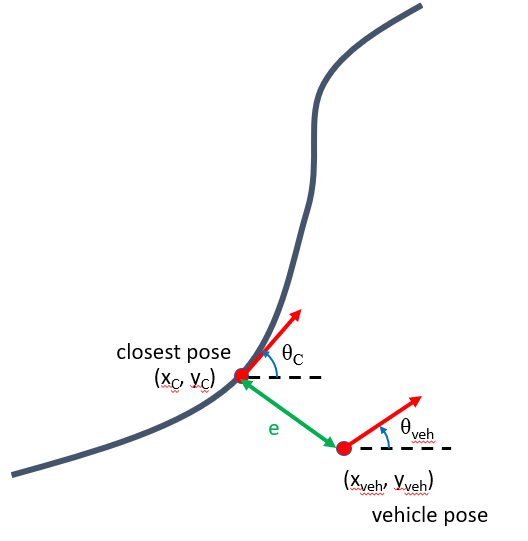

Project 2: Stanley Controller Path Following
=============================================

This project will cover how to write a stanley controller on your car to follow a path around a set of gps points. All the poses and the other info have been given to your in the ``eml4930_gps_nav`` repo. You will need a 
pose estimator from `Milestone 5 <../milestones/milestone5.html>`_

* **Due Date:** December 7th, 2022
* **Points:** 100
* ROS 2 Topics: ``vehicle_pose`` (sub), ``current_goal_pose`` (sub) and ``vehicle_command_angle`` (pub)
* ROS 2 Messages: ``PoseStamped`` (in ``geometry_msgs``) and ``VehCmd`` (in ``drive_interfaces.msg``)
  
To run this on your car you will need to git clone the ``eml4930_gps_nav`` repository that we have created for the car. You will need to clone
this into the appropriate workspace source folder, something like ``class_ws/src``. That can be done by using the following command

.. code-block:: bash

    git clone https://github.com/av-mae-uf/eml4930_gps_nav.git

If you have cloned it previously, run a :code:`git pull` to update the repository. Don't put any of your packages in the repo directory it will be deleted when you run the next update command.

Deliverables
^^^^^^^^^^^^
ROS 2 node that writes a Stanley controller as discussed in class in place of the ``vehicle_controller`` node.

* ``setup.py`` file filled out
* ``package.xml`` file filled out properly
* This is a qualitative assessment so no submissions are needed. You will need to run the node at Flavet Field by the due date. Grading will be based
on the closeness to the path given.
  
.. warning:: The names of topics are important writing the topic names incorrectly will break the node.

Creating the Path to Follow
^^^^^^^^^^^^^^^^^^^^^^^^^^^

The points that you will be visiting are available :download:`here <project_files/points.kml>`. You will then need to create a path in google earth that follows these points and output a path ``.kml`` file. The order does not matter.
To convert this navigate into scripts inside the ``eml4930_gps_nav`` package that was provided, there is a ``.kml`` file converter to ``.txt`` of poses.  You can do this by running the following command inside the scripts folder.

.. code-block:: bash

    python3 kml_to_route.py  example_file.kml  output_file.txt

Now you should have a complete pose list to run this project.

Stanley Controller (Or Controller You Prefer)
^^^^^^^^^^^^^^^^^^^^^^^^^^^^^^^^^^^^^^^^^^^^^

You can use any controller you'd like for this project except the point at the carrot and the controller that is given in the repository.

.. note:: The stanley controller would be the easiest to implement.

The stanley controller [1]_  is controller developed by the Stanford Racing Team during the 2005 DARPA Grand Challenge. Stanley, the teams 
vehicle went on to win the competition. 

The outputs and inputs to this controller are given below.

Inputs:
    * Vehicle Pose: :math:`x_{veh}`. :math:`y_{veh}`, :math:`\theta_{veh}`
    * Closest Pose on Path: :math:`x_{c}`, :math:`y_{c}`, :math:`\theta_{c}`

Outputs:
    * Steering Angle: :math:`\phi`

The objective is to essentially determine the change is steering angle to drive to the closest point and orientation 
on a path based on the current vehicle position and orientation. It will essentially be minimizing the difference in heading and the 
the cross track error :math:`e`.

    
    Figure 1: Definition of Stanley Controller Problem

The governing equation of this controller is given as follows,

.. math:: 

    \phi = \phi_{current} + K_{p1} (\theta_c - \theta_{veh}) + K_{p2} e

where e is the distance between the two points. 

.. note:: :math:`e` will be negative if the closest point on the path is to the right of the vehicle pose.

Controller File Template
^^^^^^^^^^^^^^^^^^^^^^^^
A controller file template has been given, you will need to get the ``position.x``, ``position.y`` and calculate the orientation data of the closest pose
on the path and the pose of the car to calculate the error. This can be done using the following,

.. math::

    \theta = 2*atan2(z , w) 

Check the ``vehicle_pose_callback`` and ``current_goal_pose_callback`` for all this data which has been calculated for you

The template file can be downloaded below,

:download:`Controller Template <project_files/vehicle_controller_template.py>`

Put your controller around **line 133** onwards.

Simulate your project by using a launch file similar to this,

:download:`Launch File for Point at Carrot <project_files/simulation_demo.launch.py>`

You'll have to replace the packages and executables respectively where the ``uf_extra`` launch description is.

.. note:: Your launch file should be a launch folder inside your package, something like ``package_name/launch/example_launch.py`` . Otherwise when you build the package it will fail.

Use the setup.py file given below to allow for launch files to work.

:download:`Setup File <project_files/setup.py>`

Running of Flavet Field
^^^^^^^^^^^^^^^^^^^^^^^

To run the car on Flavet field, you will need to run the motor_controller, odometry and the gps publishers. Then you can point your car East. When the car is east the 
heading value should be 0. To set this you can run

.. code-block:: bash

    ros2 param set publisher z_angle_offset <angle_to_get_to_zero>

Then go ahead and launch your launch file with your controller. An example of this can be downloaded :download:`here <project_files/vehicle.launch.py>`. Your controller should be in place of the ``stanley_controller`` in the ``example_launch.py`` given.
You will also need to put your pose list in your package inside a folder called ``data``, then update the launch file with the necessary names where it asks for the pose list. Then launch the vehicle launch file.

.. code-block:: bash

    ros2 launch <pkg-name> vehicle.launch.py

Then to launch visualizer run the launch file:

.. code-block:: bash

    ros2 launch gps_nav visualization.launch.py

Then to have the car move, you need to set a speed parameter on the ``motion_spec_provider``, to do this run the following command.

.. code-block:: bash

    ros2 param set motion_spec_provider speed 2.0

Your car should start following the path, the person running the car should follow it with their laptop, so that your don't lose connection.

.. [1] G. M. Hoffmann, C. J. Tomlin, M. Montemerlo and S. Thrun, "Autonomous Automobile Trajectory Tracking for Off-Road Driving: Controller Design, Experimental Validation and Racing," 2007 American Control Conference, 2007, pp. 2296-2301, doi: 10.1109/ACC.2007.4282788.

