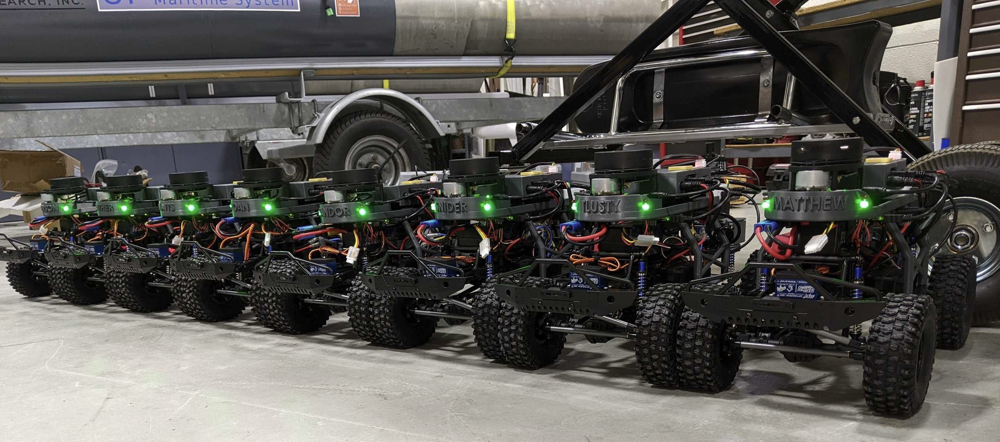

Home
====

Welcome to EML 4832: Autonomous Vehicles class documentation. This site will serve as a main page for the class. 
All information to be successful in the class will be posted up here, including all assignments, milestones, and projects.

If you are a student in the class, start at the top with `tutorial resources <assistance/tutresources.html>`_ so that you are prepared for the class.
Don't be discouraged if you are confused, we will assist you through completing this class. ROS 2 is confusing. It takes sometime to fully 
understand what it is doing.

.. .. tip:: If you want to build the car yourself for personal or other educational use, look at the vehicle information section. The `parts <vehicle_information/parts.html>`_ section outlines every piece of hardware required.

.. toctree::
   :caption: Getting Started
   :maxdepth: 1
   
   Setup <gettingstarted/setup>
   Software Tools <gettingstarted/tools>

.. toctree:: 
   :caption: Assignments
   :maxdepth: 1
   
   In Class <assignments/inclass/inclasses>
   Projects <assignments/projects/project>

.. toctree::
   :caption: Information
   :maxdepth: 1   
   
   Theoretical Information <information/theoryinfo/theoryinfo>
   ROS2 Common Messages <information/ros2_common_msgs>

.. toctree::
   :caption: Assistance
   :maxdepth: 1
   
   Lecture Videos <assistance/videos>
   Tutorial Resources <assistance/tutresources>
   Cheat Sheet <assistance/cheatsheet>
   Troubleshooting <assistance/troubleshoot>
   Canvas <https://ufl.instructure.com>

.. toctree::
   :caption: Vehicle Information
   :maxdepth: 1

   Software <vehicle_information/vehicle_software>
   Sensors <vehicle_information/sensor>
   Charging the Battery <vehicle_information/battery>

..
   Building the AV1tenth Car <information/build>

   
   
   

 
