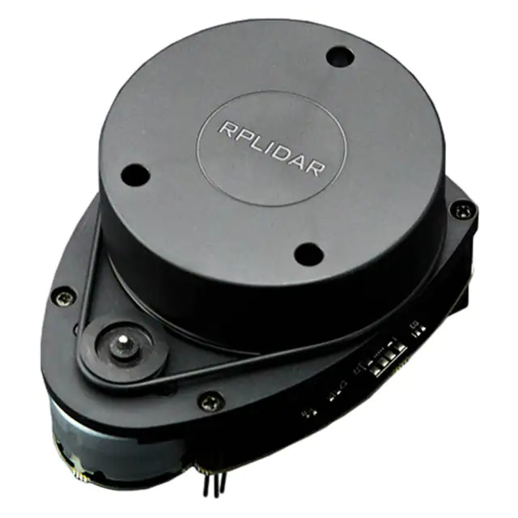
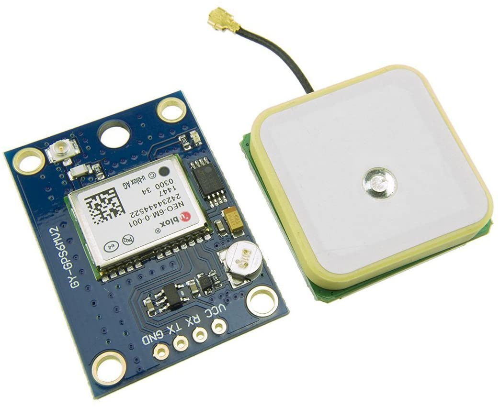

Sensor Information
===================

RPLiDAR
-------

The RPLiDAR is a single beam 360 degree Light Detection and Ranging (LiDAR) sensor from `Slamtec <https://www.google.com/search?client=safari&rls=en&q=slamtec&ie=UTF-8&oe=UTF-8>`_. We are using the A1 model from Slamtec that
has the following specifications:

* 12m Range
* 360 Degree
* 8000 per time samples
* 5.5 Hz
* Angular Resolution is 0.5 degree

A picture of how the array of ranges are given is given below:

.. image:: images/RPlidar.png
    :width: 600px
    :align: center
    :height: 450px

As seen above, the RPLiDAR ranges data starts from the -x and rotates counter-clockwise and has a 0.5 degree step size. Therefore your ``ranges[]`` array would 
be 720 long in size. 

.. note:: At this point you should know how to transform this range data to cartesian coordinates.

GPS
---

The GPS unit we are using is a uBlox NEO6M GPS module on a HiLetgo breakout board. The GPS uses NMEA strings to communicate with the Odroid UART port. Essentially, we open a UART connection to the
GPS unit and get back the Latitude and Longitude information for the sensor. We have it set to RMA information, but it can be set to others. Check the `datasheet <https://content.u-blox.com/sites/default/files/products/documents/NEO-6_DataSheet_%28GPS.G6-HW-09005%29.pdf>`_ to see all it can do.

IMU
---

The IMU that is currently being used is a 9DOF sensor, the MPU 9250. The sensor has a accelerometer, gyroscope, and magnetometer. It has been encased by the company WitMotion with custom software and a UART connection to it.

Optical Encoder
----------------

The optical encoder uses, sends out digital signals everytime the beam of light is crossed. We are using this to measure the speed of the motor output shaft for odometry. This will be used later
for SLAM.
