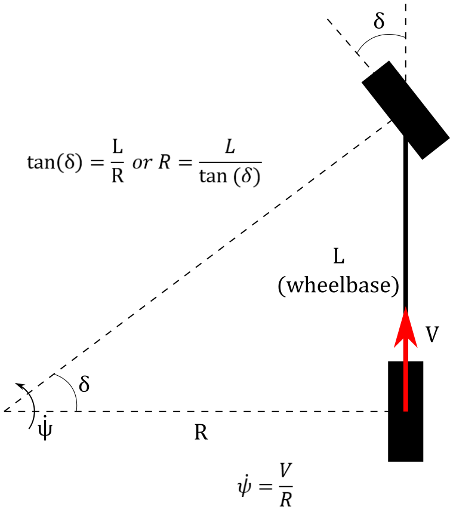

Bicycle Kinematic Model
=======================

To model the car kinematics, we have used a simple bicycle kinematic model. This is done for simplicity and ease of use over a full Ackermann Steering geometry.
The Bicycle Kinematic model assumes you know two things about your vehicle of choice, the wheelbase :math:`L` and the steering angle
:math:`\phi`.

    
    Figure 1:  Bicycle Model Diagram

This will be the basis of what will be input into the `Twist <twist.html>`_ message that will be the main mode of conveying motion to the ``motor_controller`` `node <../code/motordriver.html>`_.
To do this you will first need to input both your wheelbase and steering angle into the equation

.. math::

    R = \dfrac{L}{\tan{\delta}} \tag{1}

This is the radius of curvature that the vehicle will be traveling on. From this you can calculate the yaw rate of the vehicle which the forward
the velocity of the car in m/s. Then you can use the equation

.. math::

    \dot{\psi} = \dfrac{V}{R}

This will go in the the angular part of your ``Twist`` message that you will be using, while :math:`V` will go into the linear part of your message.
It'll be important to understand the limits of the radius of curvature as you can base you controllers off of them.

.. important:: It is important to note that due to there being a fixed differential on the car, the kinematics are slightly off and we are using a linear equation to get actual kinematics.

This essentially means based on the steering angle we can calculate a limit for the car. Through this, the limits are defined as

.. math::

    [\dfrac{L}{\tan{(-\delta_{max})}} > R > - \infty] \cup [\infty > R > \dfrac{L}{\tan{(\delta_{max})}}] \tag{2}

:math:`\infty` and :math:`-\infty` are both assumed as the car driving straight ahead.