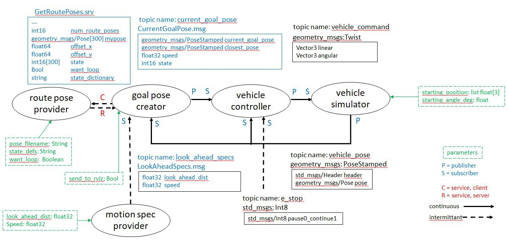
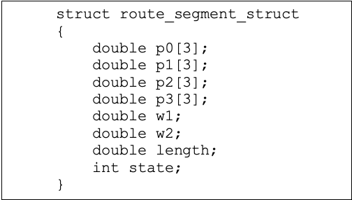
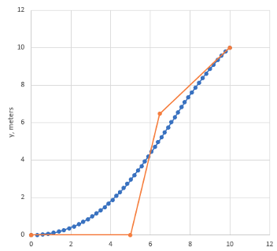
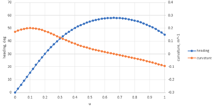

Design of Basic Navigation System in ROS 2
==========================================
Figure 1 shows a diagram of five ROS 2 nodes that can accomplish basic gps navigation.  Note that nodes are shown as ellipses, topics and services are shown as lines with arrows, standard messages are shown in black text, custom interface messages are shown in blue text, and parameters are shown in green text. A summary of what the nodes do is as follows:

    Figure 1: ROS 2 Nodes and Message Definitions to Implement Basic Navigations

Route Pose Provider
^^^^^^^^^^^^^^^^^^^^^
The first node, route_pose_provider, reads a list of desired vehicle poses from a file.  These vehicle poses form the basis of a route that the vehicle is to follow.  The file name is passed into the node as a parameter.   Other parameters used to initialize the node are *want_loop* which is a boolean value and *state_defs* which is a string.  When *want_loop* is False, it indicates that the vehicle is to stop at the last pose in the list.  When True, the vehicle is to continue from the last pose in the list to the first pose and repeat the entire path over again.  Further, each pose is assigned an interger *state* value and the parameter *state_defs* allows the user to input any desired text to explain what the state values mean.

A client/server relationship is established with the goal_pose_creator node.  When the goal_pose_creator node requests the information, 
the ``route_pose_provider`` node returns the message specified in the ``GetRoutePoints.srv`` definition.  A ``geometry_msgs:Pose`` message defines each position and 
orientation.  The units for the position data are in meters and the position data 
can be expressed in UTM (Easting/Northing) coordinates.  Vehicle orientation at each pose is defined by a heading angle where the
:math:`x` axis (East) is an orientation of :math:`0^{\circ}` and a direction along the :math:`y` axis (North) is an orientation of :math:`90^{\circ}`.  
A ``geometry_msgs:Pose`` message is used to define each pose and the heading angle is communicated as a quaternion.  

For planar motion, the quaternion :math:`q = w + a i + b j + c k` is defined in terms of the heading angle, :math:`\theta`, as

.. _target to eq14:

.. math:: 

    w = \cos{\dfrac{\theta}{2}}, a=0, b=0, c=\sin{\dfrac{\theta}{2}} \tag{14}
    
Goal Pose Creator and Motion Spec Provider
^^^^^^^^^^^^^^
The ``goal_pose_creator`` node is the most complicated node in this system.  It requests the list of poses from the ``route_pose_provider``
node and then creates the array of route segments.  The structure used to define a route segment is shown in Figure 2.  The 
default values for the route segment parameters :math:`w_1` and :math:`w_2` are set equal to 1.  The default values for :math:`L_1` and :math:`L_2` are set equal to ¼ 
the distance between the pose locations that define the route segment, i.e. points :math:`P_0` and :math:`P_3`.  Note that the length of the path segment 
is also calculated for use in future calculations.  The coordinates of the points and the length of the path segment are written in units of meters.

    Figure 2: Data Structure to Represent a Route Segment

During vehicle motion, after the ``goal_pose_creator`` node has calculated the entire array of route segments, it receives the current 
vehicle pose from the ``vehicle_simulator`` node.  The next task is to determine the point on the first route segment (segment number 0) 
which is closest to the current vehicle position.  The simplest way to calculate this is to let :math:`u` vary from 0 to 1 in small steps and 
determining the :math:`x`, :math:`y`` coordinate on the route segment for each value of :math:`u`.  The value of :math:`u` that corresponds to the closest point is recorded as well as the number of the route segment that it is on.  

The next task of the ``goal_pose_creator`` node is to calculate the pose (position and heading) of a pose on the route segment that 
is some specified distance, named the ``look-ahead-distance``, from the closest point.  The value for the look-ahead-distance is communicated to the ''goal_pose_creator'' from the ''motion_spec_provider'' along with the desired speed for the vehicle to traverse the path.    
The ``look-ahead-distance`` in the current application is 8 m as the speed of the vehicle is assumed to be approximately 2 m/sec. The value is typically increased as the speed of the vehicle increases in order to maintain stability in control.

To calculate the pose on the route segment that is the ``look-ahead-distance`` ahead of the closest point, the value of u is increased from 
the value at the closest point until the ``look-ahead-distance`` is reached.  It may be the case that the ``look-ahead`` pose is on a different route 
segment than the closest point and the segment number and value of :math:`u` for the ``look-ahead`` pose is recorded.  Equations :ref:`(2) <target to eq2>` and :ref:`(3) <target to eq3>` are used to 
obtain the :math:`x` and :math:`y` coordinates at the look ahead pose and :ref:`(6) <target to eq6>` through :ref:`(10) <target to eq10>` are used to obtain the heading angle at the look ahead pose.

The ``look-ahead-pose`` is calculated by the ``goal_pose_creator`` node each time it receives a pose message from the ``vehicle_simulator`` node. 
This data, along with a desired speed and state, is published as the ``current_goal_pose`` topic. 

Vehicle Controller
^^^^^^^^^^^^^^^^^^
The ``vehicle_controller`` node receives the ``current_goal_pose`` topic from the ``goal_pose_creator`` node together with the current 
vehicle pose that is published by the ``vehicle_simulator`` node.  The responsibility of the ``vehicle_controller`` node 
is to determine the "best" steering angle at each instant to move from the current pose to the goal pose.  This is 
accomplished by creating a new route segment where the point :math:`P_0` is the current vehicle location and :math:`P_3` is at the 
look-ahead location.  The direction of the line that connects points :math:`P_0`and :math:`P1` will be in the current heading 
direction of the vehicle.  The direction from point :math:`P_2` to :math:`P_3` will be equal to the heading direction at the 
look-ahead pose.  The parameters :math:`w_1`, :math:`w_2`, :math:`L_1`, and :math:`L_2` must be selected for this segment.  Values 
of :math:`w_1 = w_2 = 1` and :math:`L_1 = L_2 = 2 m` are suggested when the look-ahead distance is 8 m.

Figure 3 shows a route segment that has been created to move from a vehicle from its current pose to a given goal pose.  
For this example, the current position of the vehicle was :math:`(0, 0)` with a heading of :math:`0^{\circ}`.  The goal location was at the 
point :math:`(10, 10) m`, with a heading of :math:`45^{\circ}`.  The values for :math:`w_1` and :math:`w_2` are set to 1 and the values for :math:`L_1` and :math:`L_2` are set to 5 m.  
The control points :math:`P_1` and :math:`P_2` are calculated and displayed along with the route as :math:`u` varies from 0 to 1.

Once the route segment to move to the goal pose is defined, the radius of curvature of the path is evaluated at
the start of the path, i.e. :math:`u = 0`.  Figure 4 shows the heading and curvature  along the route segment as :math:`u` 
varies from 0 to 1.  The radius of curvature value when :math:`u =0` is the value that is used to command the steering of the 
vehicle at each instant.  As an example, the radius of curvature at the start of the route segment shown in Figure 2 is 
calculated as 5.8 m. The positive value indicates that the vehicle is to turn left.

    Figure 3: Route Segment from Current Pose to "Carrot" Pose

    Figure 4: Heading and Curvature along Route Segment
    
Vehicle Simulator
^^^^^^^^^^^^^^^^^
The node ``vehicle_simulator`` updates the vehicle pose based on the twist data that it receives in the vehicle_command topic.  
The current vehicle pose is continually published via the ``vehicle_pose`` topic which uses a standard 
``geometry_msgs:PoseStamped`` message.
