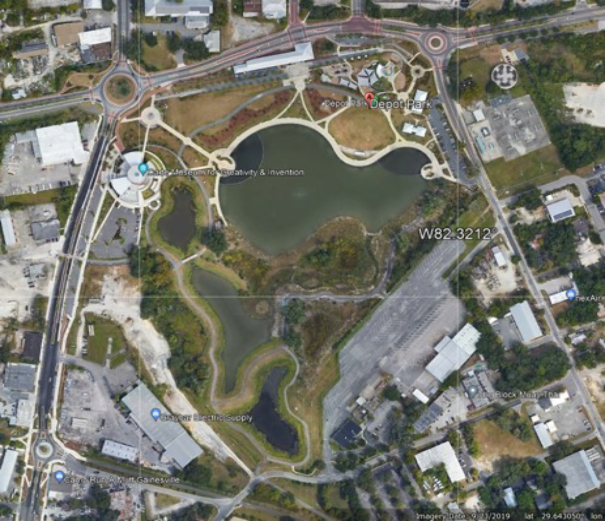
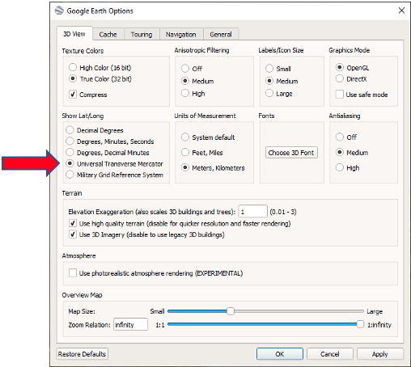
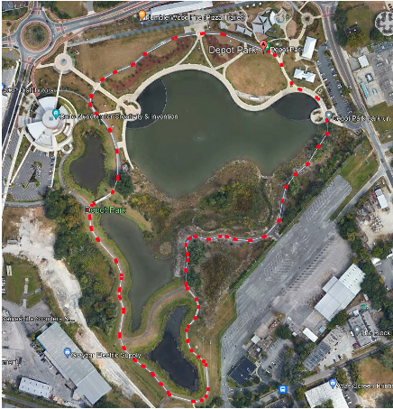
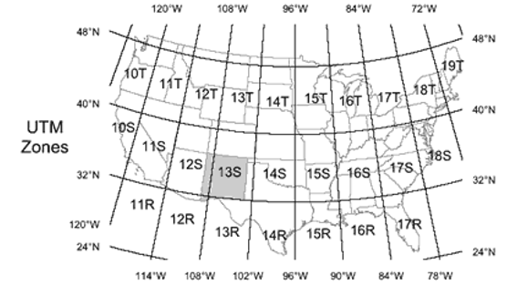
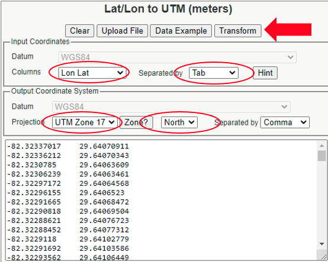
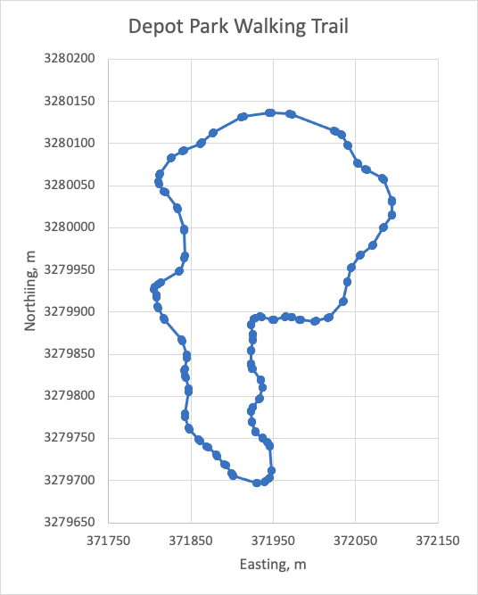

Definition of Series of Poses that will Define a Route
======================================================
A route will be defined by first identifying a series of vehicle poses, i.e. x, y, and heading. The x and y coordinates will be defined such that the x 
axis is pointed East and the y axis is pointed North. The coordinates will have units of length, typically meters.  Universal Transvers Mercator (UTM) 
coordinates can be used or an offset value can be used to establish a local origin reference.  The heading is calculated as the angle measured from the 
x axis (East) in a right-hand sense about the z axis (Up).

    
    Figure 1: Google Earth Image of Depot Park, Gainesville, Florida

Figure 1 shows an image from Google Earth.  A series of poses will be created around the walking path at the park.  A first step is to change the coordinates 
for the selected points from latitude/longitude to UTM.  In Google Earth, go to ToolsOptions.  Figure 2 shows how to change to UTM coordinates on the 3DView 
tab. Now, Google Earth displays the UTM coordinates of the cursor location.

.. note:: The coordinates of selected points will be saved in latitude/longitude values when the information is saved in a .kml formatted file.

    
    Figure 2: Change Coordinates to UTM in Google Earth Pro

    
    Figure 3: Path Created in Google Earth Pro

Next, placemarks can be added to Google Earth to identify the desired poses along the route.  Placemarks, however, are only located to the nearest meter, which 
is not accurate enough for our application.  Instead, a path will be defined in Google Earth.  Each pose will be defined by two path points.  The first path 
point gives the :math:`x`, :math:`y` coordinates of the pose, and the line connecting the two path points gives the desired heading at the pose.  Figure 3 shows the Google Earth 
path that was created around the walking path.

The next step is to output the :math:`x`, :math:`y` coordinates of all the points along the path to a text file. We desire to have a text file that has each of the path points 
written on a separate line, i.e. :math:`x`, :math:`y`, and elevation. The process to obtain this is a bit tedious, but it can be done.

Right click on the name of the path that was just created and "Save As" a ``.kml`` formatted file.  Note that the coordinates of the path points in the 
``.kml`` file are in longitude/latitude values even though the displayed coordinates for the points were in UTM coordinates.  Now start Excel and open the ``.kml`` file.  
All the path data (longitude, latitude, elevation) will be written in one cell.  Copy the data in that cell and paste it into a text file, for example
a file named ``my_path.txt``.

Open the text file (the program Notepad++ is recommended).  Search for ``0`` (zero followed by a space) and replace all instances with ``0\n``
(zero followed by a carriage return).  This will format the data so that every line contains the longitude, latitude, and elevation of a point along the path.

Next, all the point data must be converted from latitude/longitude to Universal Transverse Mercator (UTM) coordinates.  The UTM coordinate system divides
the world into sixty north-south zones, each six degrees of longitude wide.  Within each zone, coordinates are measured as easting and northing in units of meters. 
Figure 4 shows the UTM zones in the continental United States and Florida is in zone 17 R.

    
    Figure 4: UTM Zones

The conversion from latitude/longitude to UTM can be accomplished based on a standard conversion.  One means of converting a batch of lat/long data to UTM is 
available at the `site <http://www.zonums.com/online/coords/cotrans.php?module=13>`_ .  Figure 5 shows the web page.  The longitude/latitude data is pasted in 
the bottom cell.  Set the correct values for "Columns", "Separated By", and "Projection", and then press "Transform".  A new window will open that will have 
all the point data expressed in UTM Easting/Northing format.  This data was pasted into Excel and Figure 6 shows the point data along the path expressed in 
UTM coordinates.  In this figure, adjacent poses (positions and orientations) are connected by straight lines.

A second means of converting latitude/longitude to UTM coordinates is to write a program to perform the transformation.  The end of the page presents a Python program 
that uses the utm package to perform the coordinate transformation. 

The last task to be completed is to combine two path points to give one pose value :math:`(x, y, heading)`.  This can be accomplished in Excel or via a Python, 
Matlab, or C++ program.  The output file is a text file that has a pose on each line, i.e. :math:`x, y,` heading_deg, and a state value.  Comment lines, which 
begin with the ``#`` symbol, can be inserted into this file.  At this point, a text file that contains the poses to be visited has been created

    
    Figure 5: Conversion of Lat/Long to UTM

    
    Figure 6: Depot Park Path in UTM Coordinates

UTM Python Converter
^^^^^^^^^^^^^^^^^^^^

.. code-block:: python

    # Call this program as follows:
    #         py convert_to_UTM.py  input_file.txt  output_file.txt
    #
    # This program opens the file 'input_file.txt' which has latitude and longitude data on
    # each line where the values are separated by a comma.  Each latitude/longitude pair is
    # converted to UTM coordinates. The file 'output_file.txt' will have the Easting,
    # Northing, Zone Number, and Zone Letter values on each line.

    import utm
    import sys
    import math
    import numpy as np
    import csv

    def main():
        num_arg = len(sys.argv)
        if (num_arg < 3):
            print('Not enough arguments provided:')
            print('\tUseage:  convert_to_UTM.py  input_file.txt  output_file.txt')
            exit()
        else:
            fp = 0
            fp_out = 0
            in_filename = sys.argv[1]
            out_filename = sys.argv[2]
        
        try:
            fp = open(in_filename, 'r')
            csvreader = csv.reader(fp)
            rows = []
            for row in csvreader:
                rows.append(row)
        except IOError:
            print ('Error: The file ' + in_filename + ' does not exist.')
        finally:
            if (fp != 0):
                fp.close()

        try:
            fp_out = open(out_filename, 'w')
            for row in rows:
                my_lat =  float(row[0])
                my_long = float(row[1])
                utmData = utm.from_latlon(my_lat, my_long)
                my_East  = utmData[0]
                my_North = utmData[1]
                my_Zone_Num = utmData[2]
                my_Zone_Letter = utmData[3]
                print(my_East, ', ', my_North, ', ', my_Zone_Num, ', ', my_Zone_Letter, \
                    file = fp_out)
        except IOError:
            print('Error: The output file ' + out_filename + ' could not be created.')
        finally:
            if (fp_out !=0):
                fp_out.close()

    if __name__ == '__main__':
        main()

