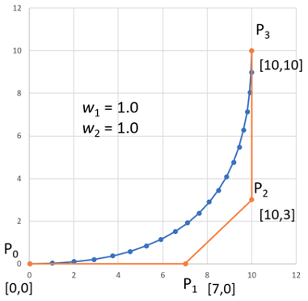
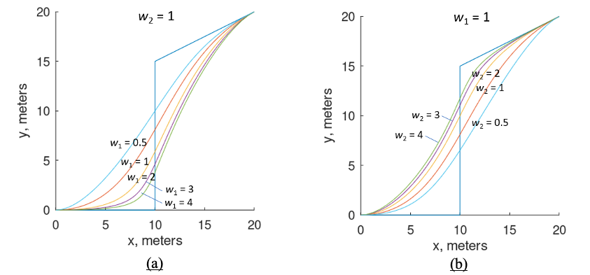
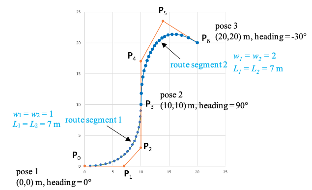

Route Segment Definition
========================
A continuous route segment will be inserted between each adjacent pair of poses that were specified in the previous section.  This route segment will be 
defined as a parametric function, i.e. :math:`x` and :math:`y` will be written as functions of a parameter :math:`u`.  For the route segment that connects poses :math:`i` and :math:`i+1`, when :math:`u=0`, 
the calculated values of :math:`x` and :math:`y` will be the position at pose :math:`i`.  When :math:`u=1`, the calculated values of x and y will be the position at 
pose :math:`i+1`.  Also the :math:`xy` path must be tangent with the heading angle at pose :math:`i` and pose :math:`i+1`.  Another requirement is that the heading angle be continuous at each of the pose points.  
In other words, the slope of the path segment that arrives at a pose location and the slope of the next path segment that departs from the pose location must 
both equal the desired heading angle at that pose.

A route segment will be defined by specifying the three-dimensional coordinates of four points, :math:`P_0`, :math:`P_1`, :math:`P_2`, and :math:`P_3` together with two scalar weighting value
:math:`w_1` and :math:`w_2`.  The equation 1 of the path is defined as

.. _target to eq1:

.. math:: 

    p(u) = \dfrac {(1-u)^3 P_0 + 3u(1-8u)^2 w_1 P_1 + 3u^2 (1-u)w_2 P_2 + u^3 P_3} {(1-u)^3 + 3u(1-u)^2 w_1 +3u^2 (1-u) w_2 + u^3} \label{1} \tag{1}

where :math:`p` represents some point on the path segment as u varies from 0 to 1. This equation defines a path segment as a third order polynomial.  
When :math:`u=0`, :math:`p(0) = P_0` and when :math:`u=1`, :math:`p(1) = P_3` and thus the path segment begins at point :math:`P_0` and ends at point :math:`P_3`.
The points P1 and P2 are control points that are not on the path.  Figure 7 shows a route segment that is defined by :math:`P_0 = [0, 0, 0]^T`,
:math:`P_1 = [7, 0, 0]^T`, :math:`P_2 = [10, 3, 0]^T`, :math:`P_3 = [10, 10, 0]^T`, and :math:`w_1 = w_2 = 1.0`.
Figure 2a demonstrates the effect of varying the weighting factor :math:`w_1` while :math:`w_2 = 1` and Figure 2b demonstrates the effect of varying the 
weighting factor :math:`w_2` while :math:`w_1 = 1`.  As can be seen in the figure, a larger value of wi draws the curve towards the path control point :math:`P_i`.  

One feature of this representation of a route segment is that at the start of the route, the line from :math:`P_0` to :math:`P_1` will be tangent to the curve. 
Similarly, at the end of the route, the line from :math:`P_2` to :math:`P_3` will be tangent to the curve. This feature makes it easy to define subsequent route segments so that there will 
be continuity at the connection point. Figure 3 shows the route segment shown in Figure 1 connected to a second route segment defined by the points 
:math:`P_3 = [10, 10, 0]^T`, :math:`P_4 = [10, 17, 0]^T`, :math:`P_5 = [13.9, 23.5, 0]^T`, and :math:`P_6 = [20, 20, 0]^T` with a weighting factor of :math:`w_1 = w_2 = 2`. As shown in the figure, 
continuity of slope will occur if the line from :math:`P_2` to :math:`P_3` is collinear with the line from :math:`P_3` to :math:`P_4`.

    
    Figure 1: Sample Route Segment with Control Points Shown

At this point, a series of :math:`(n-1)` route segments are created from the series of :math:`n` route poses as long as values for :math:`w_1`, :math:`w_2`, :math:`L_1`, and :math:`L_2` are selected for 
each of the route segments.  For the initial calculations, :math:`w_1` and :math:`w_2` are set equal to 1 and the values for :math:`L_1` and :math:`L_2` are set equal to :math:`\dfrac {1} {4}` the distance between the 
pose locations at the end of the segments, with a maximum value for :math:`L_1` and :math:`L_2` set at :math:`20 m`.

    
    Figure 2: Effect of Weighting Parameter :math:`w_1` and :math:`w_2` on Curve Shape

    
    Figure 3: Slope Continuity at Route Segment Connection Point

