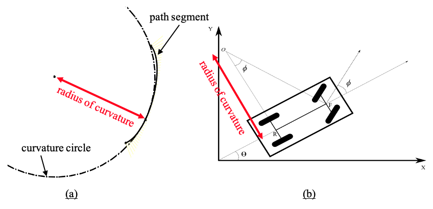

Determination of Slope and Curvature for any Value of u on a Route Segment
==================================================================================
The series of route segments represent a path for the vehicle to follow that is continuous with respect to slope (heading).  
At each value of :math:`u`, as it varies from 0 to 1 along each route segment, it is possible to calculate the slope of the curve and 
the radius of curvature.  Calculating the radius of curvature will be particularly useful.  If a route segment has a radius of
curvature that is less than what the vehicle can achieve, then it may be possible to adjust the values for :math:`w_1`, :math:`w_2`, :math:`L_1`, and :math:`L_2` in 
order to modify the radius of curvature.  Further, when route segments meet, there is continuity of slope, but not of radius of 
curvature.  It may be possible to adjust the route segment parameters :math:`w_1`, :math:`w_2`, :math:`L_1`, and :math:`L_2` to avoid any large changes in curvature 
that may occur at the connection points of adjacent route segments.

:ref:`Equation 1 <target to eq1>` can be used to determine the coordinates of any point on the route segment as u varies from 0 to 1.  For a planar case 
where :math:`z = 0`, the parametric equations for the :math:`x` and :math:`y` coordinates can be written as a function of :math:`u` as
 
.. _target to eq2:

.. math::

    x(u) = \dfrac {(1-u)^3 P_0x + 3u(1-u)^2 w_1 P_{1x} + 3u^2 ( 1-u) w_2 P_{2x} + u^3 P_{3x}} {(1-u)^3 +3u (1-u)^2 w_1 +3u^2 (1-u) w_2 +u^3} \label{2} \tag{2}

.. _target to eq3:

.. math::

    y(u) = \dfrac {(1-u)^3 P_{0y} + 3u(1-u)^2 w_1 P_{1y} + 3u^2 ( 1-u) w_2 P_{2y} + u^3 P_{3y}} {(1-u)^3 +3u (1-u)^2 w_1 +3u^2 (1-u) w_2 +u^3} \tag{3}

The slope i.e. :math:`\dfrac {dy} {du}` can be calculated as 

.. _target to eq4:

.. math::

    \dfrac {dx} {dy} = \dfrac{\dfrac{dx}{du}}{\dfrac {dy} {du}} \tag{4}

where

.. _target to eq5:

.. math::

    \dfrac{dx}{dy} = \dfrac{g(u)}{j(u)}, \dfrac{dy}{du} = \dfrac {h(u)}{j(u)} \tag{5}

and

.. _target to eq6:

.. math:: g(u) = G_4 u^4 +G_3 u^3 +G_2 u^2 +G_1 u +G_0,
    
.. math:: h(u) = H_4 u^4 +H_3 u^3 + H_2 u^2 +H_1 u +H_0, \tag{6}    

.. math:: j(u) = J_6 u^6 +J_5 u^5 + J_4 u^4 + J_3 u^3 + J_2 u^2 + J_1 u + J_0 

where

.. _target to eq7:

.. math:: j(u) = 9(J_3 u^3 + J_2 u^2 +J_1 u + J_0)^2

.. math:: J_3 = (w_1 - w_2)

.. math:: J_2 = (-2w_1 +w_2 +1) \tag{7}

.. math:: J_1 = (w_1 - 1)

.. math:: J_0 = \dfrac{1}{3}

.. _target to eq8:

.. math:: g(u) = G_4 u^4 +G_3 u^3 +G_2 u^2 + G_1 + G_0

.. math:: G_4 = ((-9p_{x1}+9p_{x2})w_2 -3 p_{x0} +9 p_{x1} -6 p_{x3}) w_1 + (6 p_{x0} -9 p_{x2} +3 p_{x3}) w_2 -3 p_{x0} +6 p_{x3}

.. math:: G_3 = ((18 p_{x1}-18 p_{x2})w_2 +12 p_{x0} -18 p_{x1} +6 p_{x3}) w_1 + (-18 p_{x0} +18 p_{x2}) w_2 +6 p_{x0} -6 p_{x3} \tag{8}

.. math:: G_2 = ((-9p_{x1}+9p_{x2})w_2 -18 p_{x0} +18 p_{x1}) w_1 + (18 p_{x0} -18 p_{x2}) w_2 -3 p_{x0} +3 p_{x3}

.. math:: G_1 = (12 p_{x0} - 12 p_{x2}) w_1 - 6 w_2 (p_{x0} - p{x2})

.. math:: G_0 = -3 w_1 (p_{x0} - p_{x1})

.. _target to eq9:

.. math:: h(u) = H_4 u^4 +H_3 u^3 +H_2 u^2 + H_1 + H_0

.. math:: H_4 = ((-9p_{y1}+9p_{y2})w_2 -3 p_{y0} +9 p_{y1} -6 p_{y3}) w_1 + (6 p_{y0} -9 p_{y2} +3 p_{y3}) w_2 -3 p_{y0} +6 p_{y3}

.. math:: H_3 = ((18 p_{y1}-18 p_{y2})w_2 +12 p_{y0} -18 p_{y1} +6 p_{y3}) w_1 + (-18 p_{y0} +18 p_{y2}) w_2 +6 p_{y0} -6 p_{y3} \tag{9}

.. math:: H_2 = ((-9p_{y1}+9p_{y2})w_2 -18 p_{y0} +18 p_{y1}) w_1 + (18 p_{y0} -18 p_{y2}) w_2 -3 p_{y0} +3 p_{y3}

.. math:: H_1 = (12 p_{y0} - 12 p_{y2}) w_1 - 6 w_2 (p_{y0} - p{y2})

.. math:: H_0 = -3 w_1 (p_{y0} - p_{y1})

Thus, to evaluate the slope (heading) for any value of :math:`u` for a given route segment, the values for :math:`G_0 \rightarrow G_4`, :math:`H_0 \rightarrow H_4`, and :math:`J_0 \rightarrow J_3` are calculated
and then :math:`g(u)`, :math:`h(u)`, and :math:`j(u)` are evaluated from (7)-(9).  The values for :math:`dx/du` and :math:`dy/du` are then determined from (5).  Finally, 
the heading angle for the point on the route segment at the value of :math:`u` is calculated as

.. _target to eq10:

.. math:: \theta = atan2(\dfrac{dy}{du} , \dfrac{dx}{du}) \tag{10}

The definition of radius of curvature with respect to the vehicle is shown in Figure 1.  In effect this value is the rate of change of the heading angle 
along the path.  The radius of curvature can be calculated as

.. _target to eq11:

.. math:: R = \dfrac{(\dot{x}^2 + \dot{y}^2)^{3/2}} {\dot{x} \ddot{y} - \dot{y} \ddot{x}} \tag{11}

    
    Figure 1: Radius of Curvature: (a) Shown at point on route segment; (b) as applied to vehicle control

where :math:`\dot{x} = \dfrac {dx} {du}`, :math:`\dot{y} = \dfrac {dy} {du}`, :math:`\ddot{x} = \dfrac {d^2 x} {du^2}`, and :math:`\ddot{y} = \dfrac {d^2 y} {du^2}`
evaluated at the particular value of :math:`u`. The second derivative terms are calculated as

.. _target to eq12:

.. math:: 

    \dfrac {d^2 x} {du^2} = \dfrac {4G_4 u^3 + 3G_3 u^2 + 2G_2 u +G_1} {9(J_3 u^3 + J_2 u^2 + J_1 u + J_0)^2} - \dfrac {2(G_4 u^4 + G_3 u^3 +G_2 u^2 + G_1 u +G_0)(3 J_3 u^2 +2 J_2 u + J_1)} {9 (J_3 u^3 + J_2 u^2 +J_1 u + J_0)^3} \tag{12}

.. _target to eq13:

.. math:: 

    \dfrac {d^2 x} {du^2} = \dfrac {4H_4 u^3 + 3H_3 u^2 + 2H_2 u +H_1} {9(J_3 u^3 + J_2 u^2 + J_1 u + J_0)^2} - \dfrac {2(H_4 u^4 + H_3 u^3 +H_2 u^2 + H_1 u +H_0)(3 J_3 u^2 +2 J_2 u + J_1)} {9 (J_3 u^3 + J_2 u^2 +J_1 u + J_0)^3} \tag{13}

and substituted into (11) to yield the radius of curvature in units of length.  A positive value indicates a left-hand turn and a negative value indicates a 
right-hand turn.
