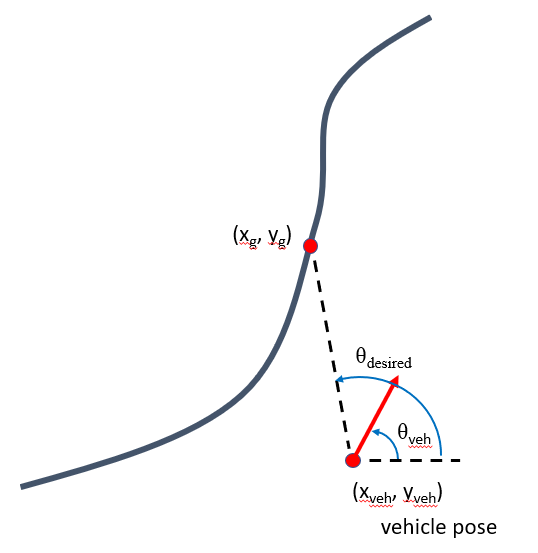
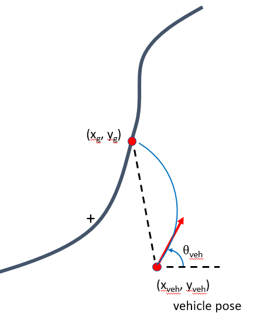
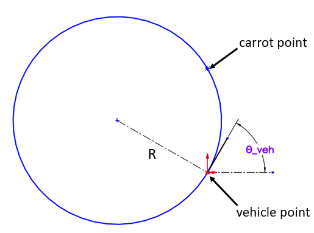

Pure Pursuit Controllers
========================

The pure pursuit controllers that are discussed are split in two different types; Point-at-Carrot and Circular Arc. They require the following
information to be input as the vehicle dynamics into the controller. An evaluation [1]_ was conducted between PID's, Pure Pursuit and Weighted Steering Control
to see which one was best by Arturo Rankin, Carl Crane and David Armstrong.

Inputs: 
    * Goal Pose: :math:`x_{goal}`, :math:`y_{goal}`
    * Vehicle Pose: :math:`x_{veh}`, :math:`y_{veh}`, :math:`\theta_{veh}`
  
Outputs:
    * Point-at-Carrot: :math:`\Delta \phi` which is the change in steering angle 
    * Circular Arc: :math:`R` which is the radius of curvature

Point-at-Carrot
^^^^^^^^^^^^^^^
To determine the steering angle delta to control the vehicle, the following can be done,

.. math::

    \theta_{error} = \theta_{desired} - \theta_{veh} .

Then the steering angle delta can be determined,

.. math::

    \Delta \phi = \phi_{current} + K_p \theta_{error},

where :math:`K_p` is the gain that must be tuned.

.. note:: :math:`\theta_{error}` may be negative.

    
    Figure 1: Diagram of Point-at-Carrot

Circular Arc
^^^^^^^^^^^^

    
    Figure 2: Diagram of Circular Arc problem

With the circular arc controller, the radius of curvature will need to be determined using the circle defined by the goal 
point and and the vehicle point with the circle being tangent to that of the vehicle heading.

    
    Figure 3: Circular Arc Radius figure.

The distance :math:`R`, or the radius of curvature is perpendicular to the heading of the vehicle, 
and a line :math:`d_3` is connected between the two points defined. Then the alpha value can be calculated using vector line math which will not be covered,
but a function will be given that can be used to calculate it.

    
    Figure 3: Solving for values to determine radius of curvature.

Then the :math:`\beta` value can be calculated. Then using equation of the line from the vehicle and carrot position and :math:`\beta` can be used
to calculate the intersection which will be center of this point. Then the radius can be calculated from here.

.. [1] Arturo L. Rankin, Carl D. Crane III, David G. Armstrong II, "Evaluating a PID, pure pursuit, and weighted steering controller for an autonomous land vehicle," Proc. SPIE 3210, Mobile Robots XII, (25 January 1998); https://doi.org/10.1117/12.299554

