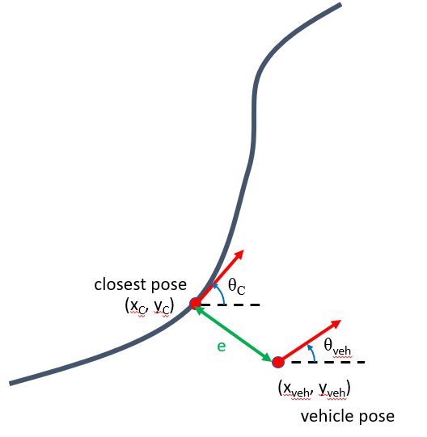

Stanley Controller
==================

The stanley controller is controller developed by the Stanford Racing Team during the 2005 Darpa Grand Challenge. Stanley, the teams 
vehicle went on to win the competition. 

The outputs and inputs to this controller are given below.

Inputs:
    * Vehicle Pose: :math:`x_{veh}`. :math:`y_{veh}`, :math:`\theta_{veh}`
    * Closest Pose on Path: :math:`x_{c}`, :math:`y_{c}`, :math:`\theta_{c}`

Outputs:
    * Change in Steering Angle: :math:`\delta \phi`

The objective is to essentially determine the change is steering angle to drive to the closest point and orientation 
on a path based on the current vehicle position and orientation. It will essentially be minimizing the difference in heading and the 
the cross track error :math:`e`.

    
    Figure 1: Definition of Stanley Controller Problem

The governing equation of this controller is given as follows,

.. math:: 

    \delta \phi = \phi_{current} + K_{p1} (\theta_c - theta_{veh}) + K_{p2} e

where e is the distance between the two points. 

.. note:: :math:`e` will be negative if the closest point on the path is to the right of the vehicle pose.